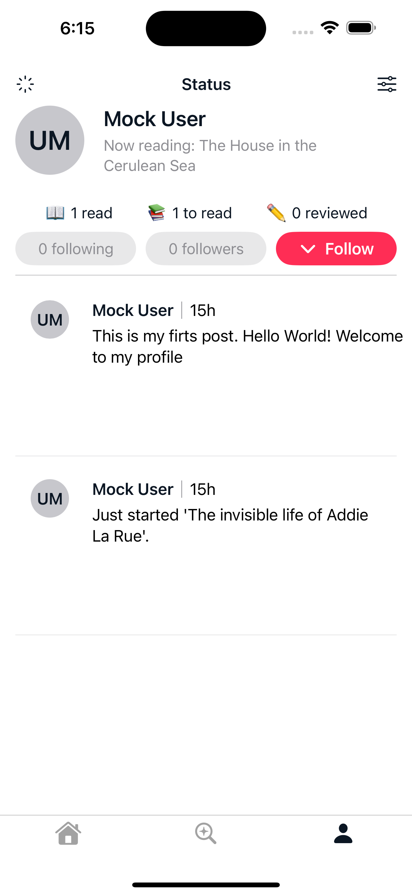
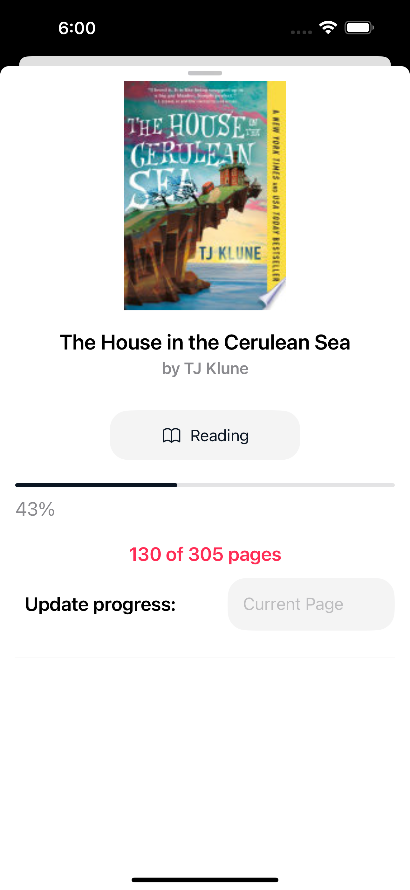
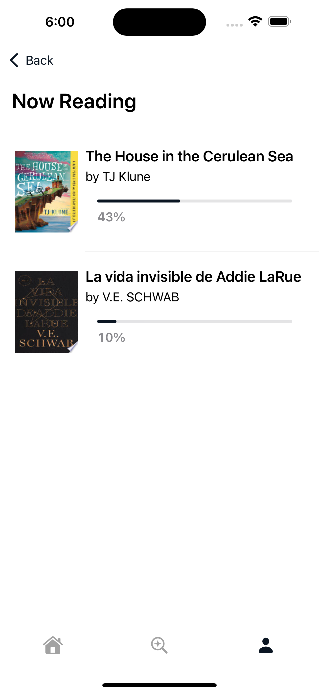
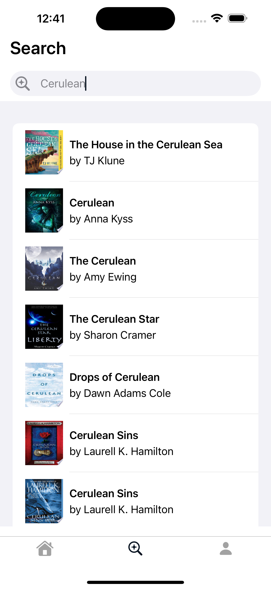
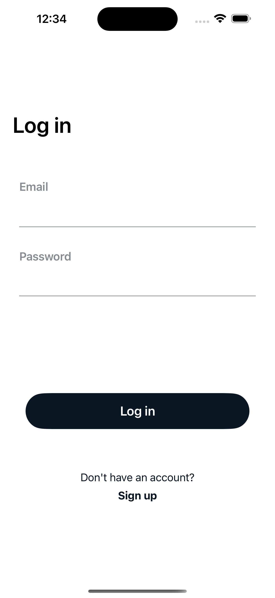
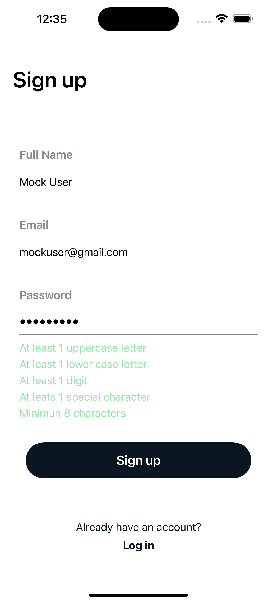

# PLOT 

#### Description: iOS app designed to help users fetch book information by title or author, manage personal libraries, and categorize books into specific lists: to read, reading, and read. The app also allows users to track their reading progress, including the current page they're on for each book.

  
  
  
  

### Features

1. User Authentication and Sync
   * Create and authenticate users with Firebase.
   * Sync user data across devices.
2. User Data Storage
   * Store and manage user data using Firebase Firestore.
3. Book Information Fetching
   * Retrieve detailed book information (title, author(s), description, publisher, etc.) from external sources.
4. Book Categorization
   * Organize books into categories: To Read, Reading, and Read.
5. Reading Progress Tracking
   * Track and update current reading progress by updating the current page.

### Tech Stack
* SwiftUI
* Xcode (iOS 17)
* Firebase Authentication
* Firestore
* Google Books API
* Disk cache

### Architecture
* The app implements a **MVVM** (Model-View-ViewModel) architecture where the view model is the bridge or connection between the Model and the View. Files ending in ViewModel contain the logic and processed Model data, for specific user interface views, while Model files are Book.swift and User.swift.

### App Structure

1. Authentication
   - **AuthViewModel.swift:** Handles user authentication through firebase.
     * Checks if there is an existing user session.
     * Users Sign-in/Log-in with email and password.
     * Fetch current user data.
2. Managers
   - **NetworkManager.swift:** handles network calls to retrieve data from the Google Books API.
     * Fetches books data by search query or book(s) ID(s).
     * Checks for cached books before making a request or stores the book data if book is selected for a category.
   - **BooksManager.swift:** stores, updates and retrieves users' book data in Firebase Firestore.
     * Updates the books dictionary to store the status and timestamp for a specific book ID.
     * Checks if a book is in the dictionary and retrieves its current status, or either moves it to a new category or leaves it unchanged.
     * Updates the reading progress dictionary for 'reading' books with the current page and timestamp.
     * Fetches users' books data to display it in UI.
3. Screens
   - Welcome
     - **WelcomeView.swift:** UI that welcomes the user to the app with two buttons to select, sign up or log in. 
   - SignUp
     - **SignUpView.swift:** Contains the UI with the name, email and password fields.
       - When focused, displays a checkmark for valid emails or 'Invalid text' for incorrect formats.
       - When focused, displays green checkmarks whenever each password requirement is met. (e.g., has uppercase letter, lowercase letter, special        character, number, etc.)
     - **SignUpViewModel.swift:** Validates the user email and password formats.
       - Sets a timer that triggers whenever the email and password fields change, allowing SignUpView to display the right checkmarks. 
       - Validates the email format (e.g., validemail.com) with a string extension in **String+Ext.swift**.
       - Validates the password format with boolean variables and a string extension.
       - Creates a new user through AuthViewModel.
   - LogIn
     - **LogInView.swift:** Contains the UI with the name and email fields.
       - When focused, displays a checkmark for valid emails or 'Invalid text' for incorrect formats.
       - Checks if both email and password formats are valid.
       - Checks for a successful log in through AuthViewModel.
     - **LogInViewModel.swift:** Validates the user email and password formats.
       - Sets a timer that triggers whenever the email and password fields change, allowing LogInView to display the right checkmarks.
       - Validates the email and password formats with string extensions and boolean variables.

  
  

   - Tabs
     - **AppTabView.swift:** Main view that contains the tabView (home, search and profile).
     - Home
       - **HomeView.swift:** Shows a list with the users posts.
     - Search
       - **SearchView.swift:** Contains the UI for a search bar that displays a list of books based on the search query.
         - The list shows each book information using a custom book cell view.
       - **SearchViewModel.swift:** Performs the network calls, percentage calculations and upgrade the reading progress.
         - Gets books information by calling the networkManager via getBooksWithDelay(), using the search query as input and storing the results in a @published variable. 
         - Filters the books result through the computed property filteredBooks, which check for matches between the search query and the book title or author name. 
    - Profile
       - **ProfileView.swift:** Displays the user's data including name, profile picture (or placeholder), current reading, total of read, to-read and reviewed books, the user's posts, and a settings button.
         - The settings button presents a sheet to change the display to dark mode, manage notifications and log out.
         - The totals for 'to-read', 'read' and 'reviewed' books are tappable, showing the corresponding lists by category.
         - The UI updates simultaneously with changes from firebase. 
       - **ProfileViewModel.swift:** Retrieves from Firebase Firestore the last reading booksID and performs the necessary network calls.
         - Keeps the last reading book updated with the updateCurrentReading() func. 
         - Gets the booksIDs from firebase firestore for each category in order to fetch the book title and count the items for the 'reading', 'to read' and 'read' categories, respectively. 
       - Profile Sections
         - Posts
           - **PostsView.swift:** Displays the user's posts with a custom posts cell. (pending)
           - **PostsViewModel.swif:t** Retrieves posts information. (pending)
         - To Read
           - **ToReadView.swift:** Shows the to-Read books in a list.
             - Uses a custom cell to show the book preview details.
             - Implements an .onAppear modifier to get the books IDs through the view model. 
           - **ToReadViewModel.swift:** Handles database and network calls.
             - The getToReadBooksIDs() function retrieves the booksIDs array by calling the books manager, and executes the second function.
             - Gets the 'to read' books from getToReadBook function, which takes as input the retrieved bookIDs array and calls the network manager.
             - Stores the 'to Read' books on a published variable.
         - Reading
           - **ReadingView.swift:** Shows the reading books in a list with its reading progress.
             - Implements an .onAppear modifier that triggers the getBooksIDs function through the view model.
             -	Zips the reading book items and current pages arrays to show a combined list.
             - Uses a custom tappable cell to show the book details, including a progress bar for the user's reading progress.
             - When a book is selected, a .sheet is presented with detailed book information and a field to update the reading progress.   
           - **ReadingViewModel.swift:** Handles database and network calls.
         - Read
           - **ReadView.swift:** Shows the read books in a list.
             - Uses a custom cell to show the book preview details.
             - Implements an .onAppear modifier to get the books IDs through the view model.
           - **ReadViewModel.swift:** Handles database and network calls.
             - The getReadBooksIDs() function retrieves the booksIDs array by calling the books manager, and executes the second function.
             - Gets the 'read' books from getReadBook function, which takes as input the retrieved bookIDs array and calls the network manager.
             - Stores the 'read' books on a published variable.
4. Model
      - **User.swift:** Contains the representation of user data.
        - Includes the user struct used with firebase firestore.
        - Conforms to the Identifiable protocol to differentiate between other users.
        - Conforms to the Codable protocol to enconde and decode from firebase firestore. 
      - **Book.swift:** Contains the representation of book data and a mock data struct for testing purposes.
        - Includes a nested book stuct that matches the JSON structure from Google Books API.
        - Conforms to the Identifiable protocol to differentiate between books.
        - Conforms to the Codable protocol for decoding data from the Google Books API.
        - Contains a mock data struct with three different mock books for testing purposes.
      - **Post.swift:** Contains the post item with its properties. (pending)
        - The view consists of mock data for testing purposes.
5. Views
   - This group includes various files which its main functionality is reusability, including cells, buttons, placeholders, and other UI components.
   - CheckMarks
     - **PasswordCheckMarks.swift:** View that represents the password validation requirements using text checkmarks.
       - Accepts five boolean variables indicating whether specific requirements are met (uppercase letter, lowercase letter, digit, special character and minimum length).
       - Displays the text in green when the rule is met or the default color if not.
       - Arranges the rules in a vertical stack. 
     - **EmailCheckMark:** View that represents the email validation usign a text checkmark.
       - Accepts a boolean variable indicating whether the email structure is correct or not.
       - Displays 'Valid email' in green when the condition is met or 'Invalid email' in the default color if not.
  - Image
    - **SearchImageCell.swift:** View that displays a book cover image fetched from a remote URL using AsyncImage. The implementation handles four possible loading states:
      - Empty: displays a secondary placeholder color (image still loading).
      - Success: displays the book cover image.
      - Failure: displays a gray color.
      - Default: displays a gray color for unexpected states.
  - Cells
    - **SPSearchCell.swift:** View that contains the structure of a list item in the search section.
      - Arranges in a horizontal stack the book cover image, title, and author(s) if available.
    - **SearchBar.swift:** View with the structure of a custom search bar.
      - Takes as input a search term.
      - Shows as placeholder 'title or author' to inform the user an example prompt.
    - **BookPreView.swift:** Structures the book preview and dynamically fetches and updates the reading progress via view model.
      - Accepts a book item and uses a @State variable to track the selected category of the book.
      - Declares a SearchViewModel instance to update the reading progress.
      - Includes book data such as cover, title and author(s).
      - Implements a dropdown menu to select the book status (to-read, reading or read).
      - When the book is selected as 'reading', the UI shows a progress bar with the achieved percentage and a field for entering the current page number. 
    - **PostCell.swift:** View that displays the text post, its timestamp and users profile. The layout is organized in horizontal and vertical stacks.
    - **SettingItem.swift:** View implemented in the setting sheet to present each label with its system image.
      - Accepts parameters for the system image name, label text, and a boolean that indicates whether the setting is toggleable.
    - **ReadingBookPreview.swift:** Cell used in the reading list to present each book's title, author and progress bar indicating the reading progress.
  - Input Fields
    - **InputView.swift:** View used for the email and password fields, ensuring a uniform design. It accepts a boolean variable that indicates whether the field is secure (for password entry) or not.
  - Buttons
    - **WelcomeButton.swift:** Contains five different types of custom buttons, including task buttons for asynchronous tasks, navigation links and regular buttons.
  - **TitleAuthorStack.swift:** Refactored view that displays the book title and the author(s) name in a vertical stack for code organization and reusability.
  - **ProfilePlaceholder.swift:** Refactored view that displays the profile picture placeholder.
  - **UserReadingsStack.swift:** Refactored view that presents the horizontal stack showing the count of books in each category within the user's profile.
   
  
        
             

